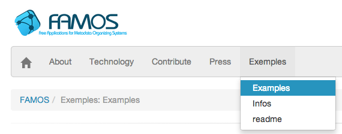
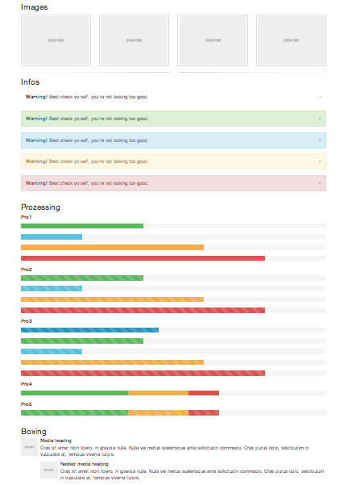
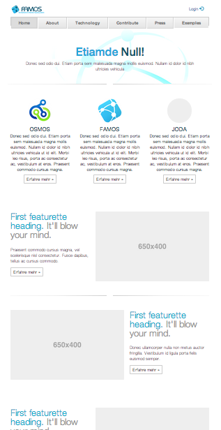
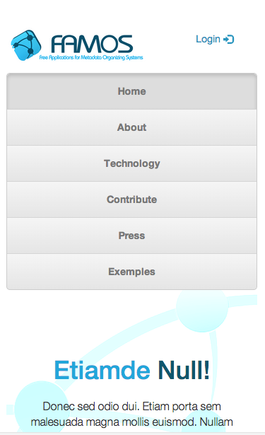
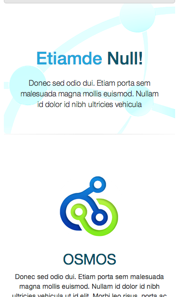

Webpage
--------

Die Website parst automatisch Markdown basierende Dateien.
 
Ihr findet diese unter dem Ordner: [docs](FAMOS-markdown-webpage/docs) dieser kann dort auch [verändert und angepasst](FAMOS-markdown-webpage/index.php#L6) werden. 

**Testpage**: [hier als Test zu finden (Wikibyte)](http://dev.wikibyte.org/FAMOS/)

Im Footer ist ein random für die Projekt Cover (Werbung muss sein?). Zusätzlich klappt am Ende der Seite ein Info Footer mit den wichtigsten Links zum Projekt auf.

###Navigation
Navigation & Links passen sich automatisch der Ordnung: "00"_"Page"_"Name" der Dateien aus dem Ordner [docs](FAMOS-markdown-webpage/docs) an.

###Startseite
Die Einstellungen der Startseite befinden sich hierbei in der [index.md](FAMOS-markdown-webpage/help/index.md) und können dort geändert und angepasst werden.

###Funktionen
Es können die Funktionen von [Bootstrap](http://getbootstrap.com/css/) Bootstrap genutzt werden. Es gibt auch ein [Example](FAMOS-markdown-webpage/docs/100_Examples/01_Examples.md).

##Einrichten

**Settings:** Siehe unter [setup.php](FAMOS-markdown-webpage/setup.php)

**Zum bearbeiten der Hauptseite:** Siehe unter [config.json](FAMOS-markdown-webpage/config.json)

##Übersicht (Standard ohne Podlove)

###Responsive Design mit Bootstraps
 
 
