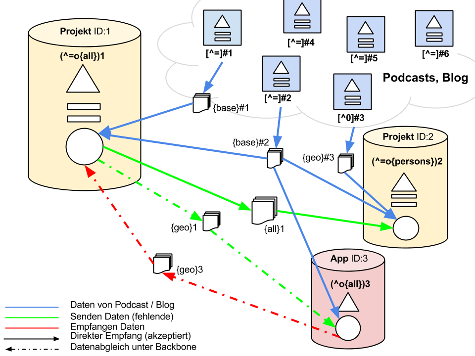

#Podcast Information System \*

**think big**  
**and different**

##Name

\* **Podcast Information System** (PIS) ist nur ein Codename und wird sich noch ändern

Da es evtl. später Sinn macht, dieses System auch für Blogs zu verwenden und andere Systeme mit Metadaten anzureichern würde ich von dem Wort Podcast im Projektnamen Abstand nehmen, obwohl es anfangs sicherlich nur Podcasts betrifft.  
Auch die Einzelteile sollten benannt werden um bei Gesprächen auf bestimmte Bereiche zu referenzieren. Beim Podlove Projekt gibt es immer wieder das Problem, dass Nutzer Bug-Reports im falschen Repo posten bzw. den Unterschied zwischen PPP und PWP nicht kennen.
Wenn wir dies verhindern könnten würde das bei künftigen Diskussionen vieles einfacher machen.  
Ein möglicher Name für den JSON Datenaustausch, also sozusagen das Frontend wäre JSON Objects Data Allocation und das Backbone Netzwerk könnte man Peer Operation Redemption Network nennen. Ich würde bei solchen Akronymen immer eine einfache Aussprechbarkeit bevorzugen.

##Konzept

Das PIS ist ein System und Format zum Austausch von Metadaten. Anfangs ist PIS für Multimedia Inhalte (wie Podcasts) gedacht, eine Erweiterung auf Blogs und andere Textinhalte ist nicht ausgeschlossen.

###Dateiformat

Das Dateiformat muss möglichst von vielen Programmiersprachen verwendet werden können, deshalb habe ich mich dort für JSON entschieden. Ausserdem müssen folgende Eigenschaften vom Dateiformat ermöglicht werden:

* verlinken/weiterleiten auf andere Orte (bei Verwendung von 3rd Party Diensten)
* cryptografische public key Signierung (+ evtl. Verschlüsselung)
* dezentrale + redundante Speicherung der Daten (Verifizierung durch Signatur)
* Haltbarkeitsangabe (ttl)
* Erweiterbarkeit auf andere Entitäten
* Anreicherbarkeit mit Zusatzinformationen
* auch in XML darstellbar
* trotz moderner Formate kompatibel zu [RDF](http://de.wikipedia.org/wiki/RDF-Schema), [VCF](http://de.wikipedia.org/wiki/VCard), [GND](http://de.wikipedia.org/wiki/Gemeinsame_Normdatei), [FoaF](http://de.wikipedia.org/wiki/FOAF), ... bleiben (also durch Converter)
* ...

###Entitätentypen
Da über die PIS Dateien verschiedenste Daten übertragen werden können/sollten ist eine Kategorisierung in Entitäten sinnvoll. Ähnlich wie in anderen Datensammlungen werden folgende Entitäten vorgeschlagen, diese Liste sollte jedoch erweiterbar sein, falls notwendig:

* [**redirect**](https://github.com/SimonWaldherr/PIS-draft/blob/master/beispieldateien/redirect.json) Weiterleitung (Weiterleitung auf andere PIS Dateien (zu verwenden auf Systemen die keine Weiterleitung (HTTP 301/2) unterstützen))
* [**overview**](https://github.com/SimonWaldherr/PIS-draft/blob/master/beispieldateien/overview.json) Übersicht (um alle unter dieser Domain verfügbaren PIS Dateien aufzulisten)
* Namen (als Übersicht ähnlich der Wikipedia Begriffsklärungsseiten (Diese Seite ist eine Begriffsklärung zur Unterscheidung mehrerer mit demselben Wort bezeichneter Begriffe.))
* [**person**](https://github.com/SimonWaldherr/PIS-draft/blob/master/beispieldateien/person.json) Personen (ausschließlich natürliche Personen und keine juristische Personen)
* [**project**](https://github.com/SimonWaldherr/PIS-draft/blob/master/beispieldateien/project.json) Körperschaften, Firmen, Projekte, Vereinigungen, Communitys
* Events (im Podcast Bezug hauptsächlich Hörertreffen und Workshops)
* [**produce**](https://github.com/SimonWaldherr/PIS-draft/blob/master/beispieldateien/produce.json) Werke (Veröffentlichungen jeglicher Art, sowohl live als auch Aufzeichnungen)
* [**geo**](https://github.com/SimonWaldherr/PIS-draft/blob/master/beispieldateien/geo.json) Geografika (Um Ortsdaten bei Dauerhaften Ereignissen zu übermitteln, bei zeitlich begrenzten Ereignissen bitte Events verwenden)
* **recepie** um Arbeitsabläufe zu beschreiben
* [**base**](https://github.com/SimonWaldherr/PIS-draft/blob/master/beispieldateien/base.json) Idee für die Standarddaten des Podcasts (Grundeinstellung)
* [**meta**](https://github.com/SimonWaldherr/PIS-draft/blob/master/beispieldateien/meta.json) Informationen zu den jeweilig aktiven Modulen (Standard erst einmal Backbone)

Die [Beispieldateien](beispieldateien/) sind nur ein vorläufiger Entwurf. Die Dateien wurden als JSON gespeichert, enthalten jedoch mit // gekennzeichnete Kommentare, diese sind für gewöhnlich nicht in JSON erlaubt und dienen nur der Dokumentation.

###Verbreitung

Um die Daten an andere Systeme zu übergeben ist ein Push-Dienst geplant, jeder Hoster von PIS-Daten kann selbst Pushen oder aber auch einen Push-Dienst verwenden.
Beim Push von PIS-Daten wird nur die URL des Objekts übergeben, das nutzende System muss die Daten dann selbst abrufen. Durch diese Art des Push wird es vereinfacht, die ursprüngliche Herkunft der Daten zu verifizieren.
Zusätzlich zum Push ist auch eine Eintragung in Feeds, als DNS Eintrag und mittels einer PIS Datei im Root Verzeichnis der Webseite (wie auch bei robots.txt, humans.txt, sitemap.xml, favicon.ico, apple-touch-icon-precomposed.png, ...) möglich.
Neben der Verbreitung als JSON Datei ist auch ein Transfer der Daten im PIS-Backbone geplant.

###API

Der Zugriff auf die Daten auf Frontend Ebene erfolgt ausschließlich über HTTP GET Requests. Um neue Daten ans Backend zu schicken wird ein HTTP POST verwendet. Im Backbone wird XMPP zur Übertragung von Daten verwendet.

###Kryptographie, Signierung und Hashing

Die Daten sollten verschlüsselt, signiert und gehasht werden können.
Verschlüsselung ist wichtig für folgende Anwendungsfälle:

* Austausch von nicht öffentlichen Daten (Firmenintern)

Signierung:

* Um Accounts und Adressen als valide und geprüft kennzeichnen zu können
* ich würde eine PKCS7 entsprechende Signierungsmethode bevorzugen

Hashing:

* Um auch bei nicht öffentlichen Adressen diese zum durchsuchen zu verwenden
* Ich schlage folgende Hashingalgos vor:
    * CRC32
    * MD5
    * Whirlpool
    * SHA512

ich würde gerne über diese Algos und die Implementierung in verschiedenen Sprachen in der Conf sprechen. Welche Algos sind sicher, schnell und in allen wichtigen Sprachen vorhanden bzw. leicht implementierbar? Für JavaScript würde ich [CRC32, MD5 und Whirlpool Hashingalgos](https://github.com/SimonWaldherr/cryptofoo) zur Verfügung stellen. In PHP können wir ebenfalls alle aufgelisteten Algos verwenden (wird von PHP mitgeliefert). Bei Python sind MD5 und CRC32 ebenfalls direkt verfügbar.

##Nutzer/Participanten

Das PIS liefert Daten bzw. bietet Daten an, mögliche Nutzer und Anbieter dieser Daten wären:

* Podlove Publisher (Anbieter)
* Firtz (Anbieter)
* hoersuppe.de (Nutzer + Anbieter)
* Shownot.es (Nutzer + Anbieter)
* Xenim Streaming (Nutzer + Anbieter)
* Event-Datenbank/Suchmaschine X (Nutzer)
* Podunion (Nutzer)
* Podbe (Nutzer + Anbieter)
* ReliveRadio (Nutzer)

##PIS-Backbone-Network

Ein separates Backbone-Netz würde eine Möglichkeit bieten, Informationen zwischen verschiedenen Services dezentral auszutauschen.
Es würde den Datenabgleich der einzelnen Services untereinander von der Präsentations-Schicht klar trennen.
So muss nicht jeder Services eine eigene RESTful-API zur Verfügung stellen, sondern kann wie alle anderen auch eine fest definierte API zum Backbone-Service nutzen.
Sicher ließe sich diese auch als lokaler REST-Service ausführen. So könnte man wie gewohnt auf bestimmte Komponenten(zum Beispiel Inhaltssuche) des Backbones via Request zugreifen.
Eine weitere Möglichkeit wäre, dem Application-Server direkt Zugriff auf eine Datenbank zu geben, welche das Backbone dann zum ablegen und abrufen von Informationen nutzt.

Eine grobe Skizze der Idee findet ihr [hier](/diagramme/01_diagramm-funktion/diagramm_big.png "Darstellung PIS") im unteren Bereich der Abbildung. Eine kurze Erklärung wird ggf. in der Konferenz folgen.

### Ein kurzer Abriss der Idee in Stichpunkten:

* Dezentraler Informationsverteiler Dienst als eigener Application Server
* Erweitert das von cato vorgeschlagene Mischprinzip und macht es flexibler
* Aggregiert Informationen über andere Server - Peering Netzwerk
    * Verbindung der Systeme bspw. über XMPP/Jabber - Subscription/Push möglich
    * Aufbau von eigenen Message-Typen möglich - Dadurch flexibel
    * (Jabber nutzt einen XML-Daten-Stream)
    * Datenformat der JSON als Grundlage nutzbar

### Vorteile:
* Getrennte mehrfach vorhandene Systeme möglich - Podcaster können ihren bevorzugten Service nutzen
    * Dennoch Datenaustausch zwischen verschiedenen allen Services möglich, wenn diese am Peering-Netz teilnehmen
* Daten müssen nicht über Crawler gesucht werden, sondern könnten über das Peer-Netzwerk jedem angeboten werden
* Crawler dennoch möglich. Als eigene Systeme die wieder Daten in das Peer-Netzwerk weitergeben
* Aufwendige Requests auf viele verschiedene APIs würden entfallen, da das Backbone-Netz diese direkt zur Verfügung stellt.
* Vollständig eigene Schicht und somit unabhängig von den anderen PIS-Layern (Kein wesentlicher Umbau der alten Strukturen)

### Nachteile:
* Aufwendige Implementierung des Peer-Netzwerkes
* Komplexere Konfiguration des Services.
* Vertrauens Frage bei Peer-Teilnehmern (sowohl als Informationsanbieter als auch Nutzer)

